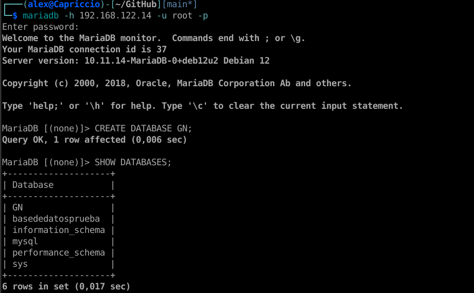
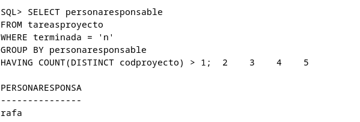
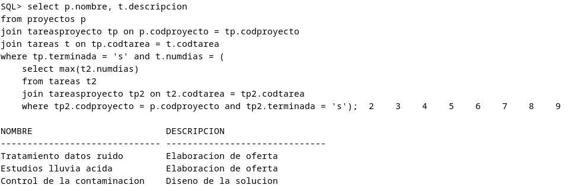

# Bloque I. Instalación de Servidores y Clientes. Interconexión de Servidores.

## 1. En este primer ejercicio tendrás que realizar algunas modificaciones que afectarán a la aplicación web que realizaste en la parte individual de la práctica 1.

### a) Crea una base de datos con el nombre GN si estás en Mongo, Postgres o MySQL. Si tu aplicación conectaba con ORACLE cambia el nombre de la instancia por GNR1 y crea un esquema para el usuario RAUL. Realiza una captura donde se aprecie este cambio. (1 punto)



# Bloque II. SQL y PL/SQL

## 1.- Realiza una consulta SQL que muestre los nombres de los trabajadores que tienen tareas sin terminar en más de un proyecto (1,5 puntos)

```sql
SELECT personaresponsable
FROM tareasproyecto
WHERE terminada = 'n'
GROUP BY personaresponsable
HAVING COUNT(DISTINCT codproyecto) > 1;
```



## 2.- Realiza una consulta SQL que muestre los nombres de los proyectos junto a la descripción de la tarea más larga que se haya terminado de cada uno de ellos. (1,5 puntos)

```sql
select p.nombre, t.descripcion
from proyectos p
join tareasproyecto tp on p.codproyecto = tp.codproyecto
join tareas t on tp.codtarea = t.codtarea
where tp.terminada = 's' and t.numdias = (
    select max(t2.numdias)
    from tareas t2
    join tareasproyecto tp2 on t2.codtarea = tp2.codtarea
    where tp2.codproyecto = p.codproyecto and tp2.terminada = 's');
```

